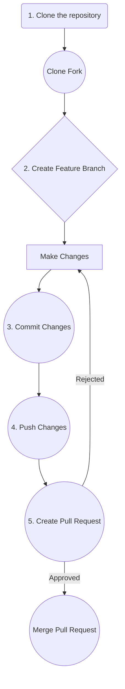

<!-- PROJECT SHIELDS -->
<!--
*** I'm using markdown "reference style" links for readability.
*** Reference links are enclosed in brackets [ ] instead of parentheses ( ).
*** See the bottom of this document for the declaration of the reference variables
*** for contributors-url, forks-url, etc. This is an optional, concise syntax you may use.
*** https://www.markdownguide.org/basic-syntax/#reference-style-links
-->
[![Contributors][contributors-shield]][contributors-url]
[![Forks][forks-shield]][forks-url]
[![Stargazers][stars-shield]][stars-url]
[![Issues][issues-shield]][issues-url]
[![MIT License][license-shield]][license-url]
[![LinkedIn][linkedin-shield]][linkedin-url]


<!-- PROJECT LOGO -->
<br />
<div align="center">
  <!-- 
  <a href="https://github.com/othneildrew/Best-README-Template">
     
  </a>
  -->

  <h3 align="center">Basketball Scoreboard</h3>

</div>


<!-- ABOUT THE PROJECT -->
## About The Project


The code [(scrimba project)](https://v2.scrimba.com/home) provides basic functionality for managing and displaying scores within a web application.

### Purpose:
The provided JavaScript code is designed to manipulate and display numerical values within HTML elements. It specifically focuses on updating and resetting scores, likely in a context like a game or scorekeeping application.

### Functionality:

* Identifies HTML elements: The code selects two HTML elements with the IDs "home-result" and "guest-result" and stores references to them in variables markerHome and markerGuest, respectively. These elements probably display the scores for two teams or players.
Defines functions:
* put(e): This function is used to increment a score. It takes an event object e as input, which presumably contains information about which team's score should be updated and the value to add. The function retrieves the current score from the appropriate HTML element, converts it to a number, adds the new value, and then updates the HTML element with the new score.
* make(e): This function is used to reset a score to zero. Similar to put, it takes an event object e and determines which score to reset based on the event information. It then sets the corresponding HTML element's content to "0".


### Built With

* HTML, CSS, JavaScript


<!-- GETTING STARTED -->
## Getting Started

To get a local copy up and running follow these simple example steps.

### Installation

1. Clone the repo
   ```sh
   git clone https://github.com/lalomax/BasketBall-Scoreboard.git
   ```
1. Open directory
   ```sh
   cd BasketBall-Scoreboard
   ```
   
<!-- ROADMAP -->
## Roadmap

### Functionality Enhancement:
- [x] Add a timer/game clock to track quarters or halves
- [ ] Include team name inputs instead of just "HOME" and "GUEST"
- [ ] Add quarter/period indicator to show game progression
- [ ] Include an undo button for accidental score changes
- [ ] Add sound effects for score updates (optional toggle)

### Visual Improvements:

- [ ] Use larger, more readable fonts for the scores
- [ ] Add color coding (different colors for each team)
- [ ] Implement responsive design for mobile devices
- [ ] Add visual feedback when buttons are clicked (animations/highlights)
- [ ] Consider a dark mode option

### Additional Features:

- [ ] Save game state (localStorage) to persist scores on page refresh
- [ ] Add fouls counter for each team
- [ ] Include timeouts tracking
- [ ] Add a game history/log showing scoring events
- [ ] Implement keyboard shortcuts for quick scoring

### Technical:

- [ ] Ensure accessibility (ARIA labels, keyboard navigation)
- [ ] Add input validation to prevent negative scores
    

See the [open issues](https://github.com/lalomax/BasketBall-Scoreboard/issues) for a full list of proposed features (and known issues).


<!-- CONTRIBUTING -->
## Contributing

Contributions are what make the open source community such an amazing place to learn, inspire, and create. Any contributions you make are **greatly appreciated**.

If you have a suggestion that would make this better, please fork the repo and create a pull request. You can also simply open an issue with the tag "enhancement".
Don't forget to give the project a star! Thanks again!

1. Fork the Project
2. Create your Feature Branch (`git checkout -b feature/AmazingFeature`)
3. Commit your Changes (`git commit -m 'Add some AmazingFeature'`)
4. Push to the Branch (`git push origin feature/AmazingFeature`)
5. Open a Pull Request




<!-- LICENSE -->
## License

Distributed under the MIT License. See `LICENSE.txt` for more information.


<!-- CONTACT -->
## Contact

Orlando - [https://x.com/OrlandoFloresH](https://x.com/OrlandoFloresH) - lalomax365.bo@gmail.com

Project [Link](https://github.com/lalomax/BasketBall-Scoreboard)


<!-- ACKNOWLEDGMENTS -->
## Acknowledgments

* [Choose an Open Source License](https://choosealicense.com)
* [GitHub Emoji Cheat Sheet](https://www.webpagefx.com/tools/emoji-cheat-sheet)
* [Malven's Flexbox Cheatsheet](https://flexbox.malven.co/)
* [Malven's Grid Cheatsheet](https://grid.malven.co/)
* [Img Shields](https://shields.io)
* [GitHub Pages](https://pages.github.com)
* [Font Awesome](https://fontawesome.com)
* [React Icons](https://react-icons.github.io/react-icons/search)


<!-- MARKDOWN LINKS & IMAGES -->
<!-- https://www.markdownguide.org/basic-syntax/#reference-style-links -->
[contributors-shield]: https://img.shields.io/github/contributors/lalomax/BasketBall-Scoreboard.svg?style=for-the-badge
[contributors-url]: https://github.com/lalomax/BasketBall-Scoreboard/graphs/contributors
[forks-shield]: https://img.shields.io/github/forks/lalomax/BasketBall-Scoreboard.svg?style=for-the-badge
[forks-url]: https://github.com/lalomax/BasketBall-Scoreboard/network/members
[stars-shield]: https://img.shields.io/github/stars/lalomax/BasketBall-Scoreboard.svg?style=for-the-badge
[stars-url]: https://github.com/lalomax/BasketBall-Scoreboard/stargazers
[issues-shield]: https://img.shields.io/github/issues/lalomax/BasketBall-Scoreboard.svg?style=for-the-badge
[issues-url]: https://github.com/lalomax/BasketBall-Scoreboard/issues
[license-shield]: https://img.shields.io/github/license/lalomax/BasketBall-Scoreboard.svg?style=for-the-badge
[license-url]: https://github.com/lalomax/BasketBall-Scoreboard/blob/master/LICENSE.txt
[linkedin-shield]: https://img.shields.io/badge/-LinkedIn-black.svg?style=for-the-badge&logo=linkedin&colorB=555
[linkedin-url]: https://linkedin.com/in/orlando-flores365/
[Next.js]: https://img.shields.io/badge/next.js-000000?style=for-the-badge&logo=nextdotjs&logoColor=white
[Next-url]: https://nextjs.org/
[Vitejs]: https://img.shields.io/badge/vite-%23646CFF.svg?style=for-the-badge&logo=vite&logoColor=white
[vite-url]: https://vitejs.dev/
[React.js]: https://img.shields.io/badge/React-20232A?style=for-the-badge&logo=react&logoColor=61DAFB
[React-url]: https://reactjs.org/
[Vue.js]: https://img.shields.io/badge/Vue.js-35495E?style=for-the-badge&logo=vuedotjs&logoColor=4FC08D
[Vue-url]: https://vuejs.org/
[Angular.io]: https://img.shields.io/badge/Angular-DD0031?style=for-the-badge&logo=angular&logoColor=white
[Angular-url]: https://angular.io/
[Svelte.dev]: https://img.shields.io/badge/Svelte-4A4A55?style=for-the-badge&logo=svelte&logoColor=FF3E00
[Svelte-url]: https://svelte.dev/
[Laravel.com]: https://img.shields.io/badge/Laravel-FF2D20?style=for-the-badge&logo=laravel&logoColor=white
[Laravel-url]: https://laravel.com
[Bootstrap.com]: https://img.shields.io/badge/Bootstrap-563D7C?style=for-the-badge&logo=bootstrap&logoColor=white
[Bootstrap-url]: https://getbootstrap.com
[JQuery.com]: https://img.shields.io/badge/jQuery-0769AD?style=for-the-badge&logo=jquery&logoColor=white
[JQuery-url]: https://jquery.com 
